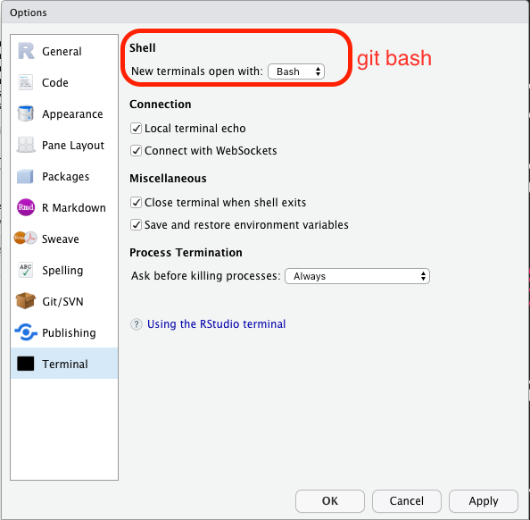
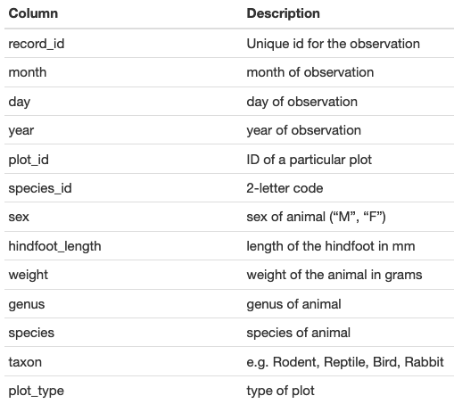

# Data analysis and visualization in R {-}

## First week {-}
+ Overview to R and RStudio  <!-- 15 -->
+ Seeking help in R
+ Introduction to R  <!-- 45 -->

## Second week {-}
+ Starting with Data  <!-- 20 -->
+ Base plot functions

## Third week {-}
+ Exploratory data analysis
+ Basic statistical functions

## Fourth week {-}
+ Manipulating Data Frames with __dplyr__  <!-- 60 -->
+ Data visualisation with ggplot2  <!-- 60 -->

----

```{r setup, include=FALSE}
options(htmltools.dir.version = FALSE)
knitr::opts_chunk$set(echo = TRUE, fig.asp = 1)
```

# Overview of R and RStudio


## why learn `R`?

+ the language of choice for academic statisticians
+ **_libre_ software**: free and free-to-be-used-and-modified for any means -> one of the pillars of open science
+ __script-based__: reproducibility, easy to scale up your analyses, transparency (track errors), great way to learn about methods.
+ __interdisciplinary and modular__: lots of code written by area specialists. At the core of its philosophy is a smooth transition from user to programmer.
+ __communication__ with other tools: manuscripts, presentations, apps and dashboards
+ communication with __other programming languages__ (ex. __reticulate__ to run python scripts)
+ great __graphic capabilities__!
+ __official support__: help in documentation, mailing lists
+ __an active and welcoming community__:  email lists, Stack Overflow, [RStudio community](community.rstudio.com/), useR groups, __R-Ladies+__ chapters, Slack communities, `r icon::fa("twitter")` `#rstats`


## `R` has a modular structure: __packages__


+ `R` __base__ installation includes base packages developed and maintained by the __`R` Core Development Team__
+ other packages are created by the community and hosted in __CRAN__ (The Comprehensive `R` Archive Network) or Bioconductor, GitHub, rOpenSci.org
+ to install packages from CRAN: `install.packages("tidyverse")`


## how to run R

+ from the R program in Windows ~~but don't~~
+ directly in the __terminal__ in Linux and Mac (just type `R`). this is important in __HPC__ environments like the UC Merced cluster (R scripts can also be run from outside R)
+ many GUIs and text editors: rgedit, __emacs ESS__, Atom, Sublime Text etc.
+ __RStudio__: an Integrated Development Environment (IDE) - Desktop Version but also Server and Cloud versions

## install, load, and cite packages


```{r, eval =F}
install.packages("dplyr")
install.packages("ggplot2")
install.packages("tidyverse") # just an umbrella package
```

+ to install dependencies: `install.packages(xxx, dependencies = TRUE)`
+ if you get an error about a missing __dependency__ copy the name of the missing package(s) and execute `install.packages()`

```{r}
library("dplyr")
citation("dplyr")
toBibtex(citation("dplyr"))
```

# About notation

+ __packages__ are collections of __functions__
+ __functions__ have __arguments__ or __parameters__ (options)

To designate them:

+ package name: __base__ (in __bold__ letters)
+ function name: `help()` (in fixed width font and with parentheses at the end)
+ objects and arguments: `data`, `na.rm` (in fixed width font)
+ sometimes you'll see `stats::median()` this is correct syntaxis `program::function()` and helps distinguish __functions with the same name__ or calling one function only (from an __installed__ package)

# The RStudio IDE

```{r, out.width=400, echo = FALSE}
knitr::include_graphics("./docs/figs/00_rstudio.png")
```


Check for the following panes:

+ Environment -> Objects in the __workspace__
+ Files
+ Plots
+ Help
+ Console

Some other that might be useful _later_:

  + __Terminal__
  + __Viewer__ (for presentations and documents)
  + __git__ (only when working inside an RStudio project)

## working directory

+ the __files__ pane is showing one folder location:

  + `Home/Documents`
  + `~/Documents`
  + `"/Users/andreasancheztapia/Documents"`


+ in `Global options > General > R Sessions` OR `cmd` + `,`
"default working directory when not in a project"


+ `getwd()` in the console


+ we have to tell R where we are working -> change the working directory

# Project organization

+ projects are better organized if we use __one folder per project__ and  __subfolders__ within our working directory
+ take care of data __provenance__: we shouldn't modify __raw data files__ but __save processed data__ (and the corresponding scripts)

In practice:

```
project/
*    ├── data/
     │   ├── raw
     │   └── processed
     ├── docs/
*    ├── figs/
     ├── R/
     ├── output/
     └── README.md
```


+ Hands on:

1. Select your folder for this project
2. Create a subfolder structure: `/figs`, and `/data`, with subfolders `/raw` and `processed`.

## RStudio projects

RStudio projects create a .Rproj file in your folder that acts as a shortcut for your projects

+ recognize the location
+ respect some project-specific preferences
+ reopen files
+ __git__ pane available

## about the workspace

+ R creates __objects__ that occupy RAM memory: the __workspace__
+ the __workspace__ can be saved and loaded between sessions BUT
+ __you can lose track of how you created the objects in the workspace__
+ `#goodpractices` don't save the workspace

```{r, out.width=400, echo = FALSE}
knitr::include_graphics("docs/figs/0b_soft_wrap.png")
```


__soft wrap__ your scripts so you don't have to scroll side to side

__soft wrap__ your scripts so you don't </br> have to scroll side to side


```{r, out.width=400, echo = FALSE}

```

check your terminal

+ we have an __RStudio project__ in the correct __working directory__, with a nice file structure and RStudio is configured
+ how did package installation go?


----

# Introduction to R

+ `<-` is the assignment operation in R and it does not return output
+ overwriting objects __does not affect other objects__
+  __naming things__: don't begin with a number or symbol. be consistent with your __coding style__!
+ separators can be anything and (you could use `.` but be nice to fellow `r icon::fa("python")` users


## data types in R

```{r datatypes}
animals  <- c("mouse", "rat", "dog")
weight_g <- c(50, 60, 65, 82)
```


```{r}
class(animals)
```


```{r class}
class(weight_g)
```


`character` and `numeric` but also `logical` and `integer` (entire numbers, with no decimal component), `complex`, and others.


## subsetting vectors

+ R is __1-indexed__ and intervals are closed (not half-open)

```{r, results = 'show'}
animals <- c("mouse", "rat", "dog", "cat")
animals[2]
```

+ Subsetting is done with brackets `[]`

```{r}
animals[c(3, 2)]
```

## conditional subsetting

```{r, results = 'show'}
weight_g <- c(21, 34, 39, 54, 55)
weight_g[c(TRUE, FALSE, FALSE, TRUE, TRUE)]
```

Nobody works like this, instead we use __logical clauses__ to __generate__ these logical vectors

## logical clauses

+ equality or not: `==`, `!=`
+ inequalities: `<`. `>`, `<=`, `>=`
+ union (OR) `|`
+ intersection (AND) `&`
+ belonging `%in%`
+ differences between sets: `setdiff()`
+ negation works `!`: "not in" `!a %in% b`

## comparing vectors

```{r recycling}

animals      <- c("mouse", "rat", "dog", "cat")
more_animals <- c("rat", "cat", "dog", "duck", "goat")

animals %in% more_animals
```


```{r recycling2}
animals      <- c("mouse", "rat", "dog", "cat")
more_animals <- c("rat", "cat", "dog", "duck", "goat")

animals == more_animals
```

+ Vectors are compared __one by one AND recycled__ when one of them is shorter, so use `%in%` when you want to check __belonging to a set__

## missing data

```{r na}
heights <- c(2, 4, 4, NA, 6)
mean(heights)
max(heights)
mean(heights, na.rm = TRUE)
max(heights, na.rm = TRUE)
```

## data structures

+ __vector__: lineal arrays (one dimension: only length)
+ __factors__: vectors (one-dimensional) representing __categorical variables__ and thus having __levels__
+ __matrices__: arrays of vectors -> the same type (all numeric or all character, for instance) (two dimensions: width and length)
+ __data frames__: two-dimensional arrays but might be of combined types (i.e., column 1 with names, column 2 with numbers)
+ __arrays__ are similar to matrices and dataframes but may be three-dimensional ("layered" data frames)
+ __list__: literally a list of anything (a list of data frames, or different objects)

# Starting with data


## the survey dataset

+ One row per individual


```{r columns, echo = FALSE, out.width = 500, fig.align='center'}

```


## downloading the dataset

We are going to download the file to our `data/raw` sub folder:

```{r, echo = FALSE, eval = TRUE}
if (!file.exists("data/raw")) dir.create("data/raw")
if (!file.exists("data/raw/portal_data_joined.csv")) {
download.file(url = "https://ndownloader.figshare.com/files/2292169",
              destfile = "data/raw/portal_data_joined.csv")
}
```

```{r, eval = FALSE}

download.file(url = "https://ndownloader.figshare.com/files/2292169",
              destfile = "data/raw/portal_data_joined.csv")
```


## reading files into R

Functions to read data are key to any project.
for data frames: `read.csv()`, `read.delim()`


```{r}
surveys <- read.csv("data/raw/portal_data_joined.csv")
surveys_check <- read.table(file = "data/raw/portal_data_joined.csv",
                            sep = ",",
                            header = TRUE)
identical(surveys, surveys_check)
```

There are __many other ways__ to read data into R, some are specific for the type of data (GIS shapefiles or raster, and specific packages may come with their own reader functions)


```{r try, echo = TRUE, eval = TRUE}
str(surveys)
head(surveys) # 6 rows by default
tail(surveys)
names(surveys)
summary(surveys)
length(surveys) # number of columns
dim(surveys)
nrow(surveys)
ncol(surveys)

```


## inspecting `data.frame` objects

Based on the output of `str(surveys)`, can you answer the following questions?

+ What is the class of the object surveys?

```{r, echo = TRUE}
class(surveys)
```

+ How many rows and how many columns are in this object?

```{r, echo = TRUE}
ncol(surveys)
nrow(surveys)
dim(surveys)
```

+ How many species have been recorded during these surveys?

```{r, echo = TRUE}
names(surveys)
unique(surveys$species_id)
length(unique(surveys$species_id))
length(unique(surveys$species))
```

# Indexing and subsetting data frames

+ a vector has only one dimension, so:

  + `length()` refers to number of __elements__
  + `dim()`
  + selection between brackets `[]`

```{r}
sp <- surveys$species_id
length(sp)
sp[3]
```

+ a data.frame has __two__ dimensions, so `dim()`, `ncol()`, `nrow()`

```{r}
dim(surveys)
ncol(surveys)
nrow(surveys)

```


+ selection between brackets `[]` BUT with the two dimensions separated by a comma: `[rows, columns]`

```{r, eval = FALSE}
names(surveys)
surveys[, 6]
surveys[1, ]
surveys[ , 13]
surveys[4 , 13]
```


```{r, eval = FALSE, echo = TRUE}
# first element in the first column of the data frame (as a vector)
surveys[1, 1]
# first element in the 6th column (as a vector)
surveys[1, 6]
# first column of the data frame (as a vector)
surveys[, 1]
# first column of the data frame (as a data.frame)
surveys[1]
# first three elements in the 7th column (as a vector)
surveys[1:3, 7]
# the 3rd row of the data frame (as a data.frame)
surveys[3, ]
# equivalent to head_surveys <- head(surveys)
head_surveys <- surveys[1:6, ]
```


+ minus sign to __remove__ the indexed column or row


```{r, eval = TRUE}
# The whole data frame, except the first column
# surveys[, -1]
surveys[-(7:34786), ] # Equivalent to head(surveys)
```

## subsetting by name

```{r subset, eval = FALSE}
  surveys["species_id"]       # Result is a data.frame
  surveys[, "species_id"]     # Result is a vector
  surveys[["species_id"]]     # Result is a vector
  surveys$species_id          # Result is a vector
```

+ R has several ways to do some things

## challenge


+ Create a data.frame (`surveys_200`) containing only the data in row 200 of the `surveys` dataset

+ Notice how `nrow()` gave you the number of rows in a data.frame? Use that number to pull out just that last row in the data frame

+ Compare that with what you see as the last row using `tail()` to make sure it’s meeting expectations

+ Pull out that last row using `nrow()` instead of the row number.

+ Create a new data frame (`surveys_last`) from that last row.

+ Use `nrow()` to extract the row that is in the middle of the data frame. Store the content of this row in an object named `surveys_middle`.

+ Combine `nrow()` with the - notation above to reproduce the behavior of `head(surveys)`, keeping just the first through 6th rows of the surveys dataset.


## factors

+ __factors__: vectors (one-dimensional) representing __categorical variables__ and thus having __levels__. ordered or unordered (`c(“low”, “medium”, “high”)`

+ R < 4.0 had a default behavior `stringsAsFactors = TRUE` so any character column was transformed into a factor

```
`?read.csv()`
?default.stringsAsFactors
```

+ __today if we want factors we have to transform the vectors__


```{r eval = FALSE, echo= TRUE}
## Compare the difference between our data read as
#`factor` vs `character`.
surveys <- read.csv("data/raw/portal_data_joined.csv",
                    stringsAsFactors = TRUE)
str(surveys)
surveys <- read.csv("data/raw/portal_data_joined.csv",
                    stringsAsFactors = FALSE)
str(surveys)
## Convert the column "plot_type" and sex into a factor
surveys$plot_type <- factor(surveys$plot_type)
surveys$sex <- factor(surveys$sex)
```

### working with factors

```{r, echo = TRUE, eval = FALSE}
sex <- factor(c("male", "female", "female", "male"))
levels(sex) # in alphabetical order!
nlevels(sex)
sex
sex <- factor(sex, levels = c("male", "female"))
sex # after re-ordering
as.character(sex)

year_fct <- factor(c(1990, 1983, 1977, 1998, 1990))
as.numeric(year_fct)               # Wrong! And there is no warning...
as.numeric(as.character(year_fct)) # Works...
as.numeric(levels(year_fct))
as.numeric(levels(year_fct))[year_fct]    # The recommended way.
```

__Let's make a plot of a factor variable__

`plot(as.factor(surveys$sex))`

let's rename this label

```{r plot, eval = TRUE, echo = FALSE}
plot(as.factor(surveys$sex))
#take the variable out
sex <- factor(surveys$sex)
#head(sex, n = 6)
#levels(sex)
levels(sex)[1] <- "undetermined"
#levels(sex)
#head(sex) # hasta aquí con ellos
```


`plot(sex)`

let's rename this label

```{r plot2, eval = TRUE, echo = FALSE}
plot(sex)
```


### challenge


```{r, eval = TRUE}
levels(sex)[2] <- "female"
levels(sex)[3] <- "male"
sex <- factor(sex, levels = c("female", "male", "undetermined"))
plot(as.factor(sex))
```


+ Rename “F” and “M” to “female” and “male” respectively.

+ Now that we have renamed the factor level to “undetermined”, can you recreate the barplot such that “undetermined” is last (after “male”)?


----
# Week four: Manipulating and analyzing data with dplyr and the tidyverse


```{r, out.width=150, echo = FALSE}
knitr::include_graphics("https://d33wubrfki0l68.cloudfront.net/621a9c8c5d7b47c4b6d72e8f01f28d14310e8370/193fc/css/images/hex/dplyr.png")
```


## the tidyverse: an "umbrella" package

+ __ggplot2__: a "grammar of graphics" by Hadley Wickham. Divide the data and the <br> aesthetics. Create and modify the plots layer by layer
+ __dplyr__: a way to lead with data frames, sql external data bases, written in `C++`
+ __readr__: read data
+ __tidyr__: format data frames
+ __stringr__: deals with strings
+ additional packages for other tasks: __tibble__, __lubridate__ and many more

Most of R is still __base__-based and both philosophies communicate well with each other


## reading data with __readr__

```{r dplyr, message=FALSE}
library(dplyr)
library(readr)
```


```{r}
surveys <- readr::read_csv("data/raw/portal_data_joined.csv")
```


```{r, eval = F}

## inspect the data
str(surveys)

```


```{r, eval = FALSE}

View(surveys)

```

```{r, eval = FALSE}
surveys
```


## some principal functions in __dplyr__

+ __select__ (columns)
+ __filter__ (rows)
+ __rename__ (columns)
+ __mutate__ (create new columns or modify existing columns)
+ __arrange__ to sort according to a column
+ __count__ cases of one or many columns


### `select()` columns

```{r}
select(surveys, plot_id, species_id, weight)
```

1. there is no need to put quotes
2. there is no need to put variables between `c()`


__base R still works in a tibble!__

```{r, results='hide'}
surveys[, c("plot_id", "species_id", "weight")]
```


### removing columns

```{r, results='hide'}
select(surveys, -record_id, -species_id)
```


### additional functions

```{r, results='hide'}
select(surveys, -ends_with("id"))
```


### `filter()` rows

__logical clauses!__

```{r remedy010, results='hide'}
surv_1995 <- filter(surveys, year == 1995)
```

__No need to use $ or brackets__

```{r, results = "hide"}
surveys$year == 1995
surveys[surveys$year == 1995 , ]
```


### `mutate()` creates or modifies columns

```{r, results = "hide"}
surveys <- mutate(surveys, weight_kg = weight / 1000)
```

```{r, eval = FALSE}

mutate(surveys,
       weight_kg = weight / 1000,
       weight_lb = weight_kg * 2.2)

```


### `group_by()` and `summarise()`

+ if you have a column factor (e.g. sex) and want to apply a function to the levels of this factor

```{r, message=F, warning=F}
surveys_g <-group_by(surveys, sex) #does nothing?
summary_sex <- summarize(surveys_g,
                         mean_weight = mean(weight, na.rm = TRUE))
summary_sex
```


### another example:

```{r, warning=F, message=F}
surveys_g2 <-group_by(surveys, sex, species_id)
mean_w <- summarize(surveys_g2,
                    mean_weight = mean(weight, na.rm = TRUE))
```


```{r}
mean_w

```


### `arrange()` sorts by a column

```{r arraange, eval = FALSE}
arrange(mean_w, mean_weight)


arrange(mean_w, desc(mean_weight))


```


## the pipe operator

Classic syntax goes like this

```r
object1
object2 <- function1(object1)
object3 <- function2(object2)
```

The pipe operator allows to apply functions sequentially:

```r
object3 <- object1 %>% function1() %>% function2()
```

+ functions in the tidyverse work very well with pipes


### `select()` and `filter()`

```{r}
surveys2 <- filter(surveys, weight < 5)
surveys_sml <- select(surveys2, species_id, sex, weight)

surveys %>%
  filter(weight < 5) %>%
  select(species_id, sex, weight)

```


### `group_by()` and `summarize()`

```{r, warning=F, message=F}
surveys_g   <- group_by(surveys, sex) #does nothing?
summary_sex <- summarize(surveys_g,
                         mean_weight = mean(weight, na.rm = TRUE))


summary_sex <- surveys %>%
  group_by(sex) %>%
  summarize(mean_weight = mean(weight, na.rm = TRUE))
```


### `count()`

```{r}
surveys %>%
    count(sex)

surveys %>%
  count(sex, species)

surveys %>%
  count(sex, species) %>%
  arrange(species, desc(n))
```


### challenge


+ How many animals were caught in each `plot_type` surveyed?
+ Use `group_by()` and `summarize()` to find the mean, min, and max hindfoot length for each species (using `species_id`). Also add the number of observations (hint: see `?n`).


```{r}
surveys %>%
    count(plot_type)

surveys %>%
    filter(!is.na(hindfoot_length)) %>%
    group_by(species_id) %>%
    summarize(
        mean_hindfoot_length = mean(hindfoot_length),
        min_hindfoot_length = min(hindfoot_length),
        max_hindfoot_length = max(hindfoot_length),
        n = n()
    )
```


## save data!

```{r, echo = TRUE}
surveys <- readr::read_csv("data/raw/portal_data_joined.csv")

surveys_complete <- surveys %>%
  filter(!is.na(weight),
         !is.na(hindfoot_length),
         !is.na(sex))

species_counts <- surveys_complete %>%
    count(species_id) %>%
    filter(n >= 50)

surveys_complete <- surveys_complete %>%
  filter(species_id %in% species_counts$species_id)

write_csv(surveys_complete, path = "data/processed/surveys_complete_dplyr.csv")

```

 <!-- dim(surveys_complete) # 304463, 13 -->


class: middle, center
## data visualization with __ggplot2__


# __ggplot2__


+ __ggplot2__ separates the data from the aesthetics part and allows layers of information to be added sequentially with `+`

```r
ggplot(data = <data>,
       mapping = aes(<mappings>)) +
  geom_xxx()
```

+ __data__
+ __mappings__: the specific variables (x, y, z, group...)
+ __geom_xxx()__: functions for plotting options `geom_point()`, `geom_line()`

[cheat sheet link](https://rstudio.com/wp-content/uploads/2015/03/ggplot2-cheatsheet.pdf)


## ggplot2 plots are built sequentially in layers


```{r ggplot, echo= TRUE, eval = TRUE, message=F, warning=F}
library(ggplot2)
library(readr)

surveys_complete <- read_csv("data/processed/surveys_complete.csv")

```


```{r, out.width=350}
ggplot(data = surveys_complete,                          # data
       mapping = aes(x = weight, y = hindfoot_length)) + # aesthetics
  geom_point()                                        # plot function
```


## you can assign a plot to an object and build on it


```{r, out.width=350}
surveys_plot <- ggplot(data = surveys_complete,
                       mapping = aes(x = weight,
                                     y = hindfoot_length))
surveys_plot +
    geom_point()
```


you can modify each layer


```{r, out.width=350}
surveys_plot +
    geom_point(alpha = 0.1) #transparency
```


```{r, out.width=350}
surveys_plot +
    geom_point(alpha = 0.1, color = "blue") #color
```


```{r, out.width=350}
surveys_plot +
    geom_point(alpha = 0.1, aes(color = "blue")) #this is a mistake!
#blue is not a variable so it should not go inside aes()
```


```{r, out.width=350}
surveys_plot +
    geom_point(alpha = 0.1, aes(color = species_id))
# but variables do go inside aes()
```


## challenge: change x to categorial variable


```{r, out.width=350}
ggplot(data = surveys_complete,
       mapping = aes(x = species_id, y = weight)) +
   geom_point(aes(color = plot_type))
```


## boxplots!


```{r, out.width=350}
# boxplots
ggplot(data = surveys_complete,
       mapping = aes(x = species_id, y = weight)) +
   geom_boxplot()
```


## theme options `theme_`


```{r, out.width=350}
ggplot(data = surveys_complete,
       mapping = aes(x = species_id, y = weight)) +
   geom_boxplot() +
  theme_classic()
```


## add jitter layer


```{r, out.width=350}
ggplot(data = surveys_complete,
       mapping = aes(x = species_id, y = weight)) +
   geom_boxplot() +
  geom_jitter(alpha = 0.3, color = "dodgerblue", width = 0.2) +
  theme_classic()
```


## change plot order


```{r, out.width=350}
ggplot(data = surveys_complete,
       mapping = aes(x = species_id, y = weight)) +
  geom_jitter(alpha = 0.3, color = "dodgerblue", width = 0.2) +
  geom_boxplot() +
  theme_classic()
```


## violin plots


```{r, out.width=350}
ggplot(data = surveys_complete,
       mapping = aes(x = species_id, y = weight)) +
   geom_violin() + theme_classic()
```


## change scale (`scale_xx` options)


```{r, out.width=350}
p <- ggplot(data = surveys_complete,
       mapping = aes(x = species_id, y = weight)) +
   geom_violin() + scale_y_log10() + theme_classic() #nice!
p
```


## add title `ggtitle()`

```{r, out.width=350}
p +  #remember the plot can be an object
  ggtitle("Nice violin plot")
```


```{r, out.width=350}
ggplot(data = surveys_complete,
       mapping = aes(x = species_id, y = hindfoot_length)) +
  geom_jitter(size = 0.5, alpha = 0.1, width = 0.2, aes(col = plot_id)) +
  geom_boxplot() +
  scale_y_log10() +
  theme_classic() +
  ggtitle("Nice violin plot")
```


