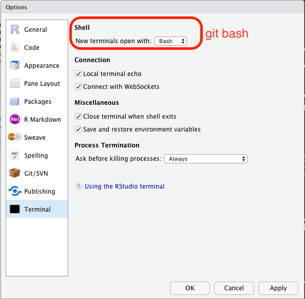
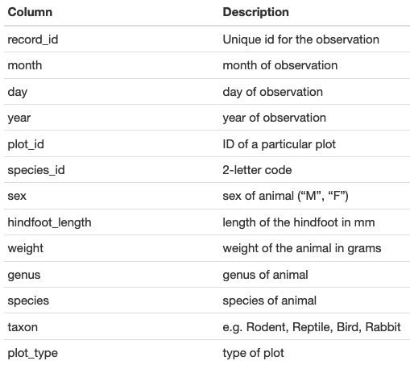

Data analysis and visualization in R
====================================

-   Overview to R and RStudio
-   Introduction to R
-   Starting with Data
-   Manipulating Data Frames with **dplyr**
-   Data visualisation

------------------------------------------------------------------------

Overview of R and RStudio
=========================

why learn `R`?
--------------

-   ***libre* software**: free and free-to-be-used-and-modified for any
    means -&gt; one of the pillars of open science
-   **script-based**: reproducibility, easy to scale up your analyses,
    transparency (track errors), great way to learn about methods.
-   **interdisciplinary and modular**: lots of code written by area
    specialists. At the core of its philosophy is a smooth transition
    from user to programmer.
-   **communication** with other tools: manuscripts, presentations, apps
    and dashboards
-   communication with **other programming languages** (ex.
    **reticulate** to run python scripts)
-   great **graphic capabilities**!
-   **official support**: help in documentation, mailing lists
-   **an active and welcoming community**: email lists, Stack Overflow,
    [RStudio community](community.rstudio.com/), useR groups,
    **R-Ladies+** chapters, Slack communities,
    <!--html_preserve--><i class="fab  fa-twitter "></i><!--/html_preserve-->
    `#rstats`

`R` has a modular structure: **packages**
-----------------------------------------

-   `R` **base** installation includes base packages developed and
    maintained by the **`R` Core Development Team**
-   other packages are created by the community
-   hosted in **CRAN** (The Comprehensive `R` Archive Network) or
    Bioconductor, GitHub, rOpenSci.org
-   a package is a collection of functions, it must be loaded to be used
    (ex. `library(dplyr)`)
-   the whole package is loaded, not some functions or parts of it. if
    you want to use one function you can use `package::function()`

how to run R
------------

-   from the R program in Windows <s>but don’t</s>
-   directly in the **terminal** in Linux and Mac (just type `R`). this
    is important in **HPC** environments like the UC Merced cluster (R
    scripts can also be run from outside R)
-   many GUIs and text editors: rgedit, **emacs ESS**, Atom, Sublime
    Text etc.
-   **RStudio**: an Integrated Development Environment (IDE) - Desktop
    Version but also Server and Cloud versions

install, load, and cite packages
--------------------------------

    install.packages("dplyr")
    install.packages("ggplot2")
    install.packages("tidyverse") # just an umbrella package

-   to install dependencies:
    `install.packages(xxx, dependencies = TRUE)`
-   if you get an error about a missing **dependency** copy the name of
    the missing package(s) and execute `install.packages()`

<!-- -->

    library("dplyr")

    ## 
    ## Attaching package: 'dplyr'

    ## The following objects are masked from 'package:stats':
    ## 
    ##     filter, lag

    ## The following objects are masked from 'package:base':
    ## 
    ##     intersect, setdiff, setequal, union

    citation("dplyr")

    ## 
    ## To cite package 'dplyr' in publications use:
    ## 
    ##   Hadley Wickham, Romain François, Lionel Henry and Kirill Müller
    ##   (2020). dplyr: A Grammar of Data Manipulation. R package version
    ##   1.0.2. https://CRAN.R-project.org/package=dplyr
    ## 
    ## A BibTeX entry for LaTeX users is
    ## 
    ##   @Manual{,
    ##     title = {dplyr: A Grammar of Data Manipulation},
    ##     author = {Hadley Wickham and Romain François and Lionel {
    ##              Henry} and Kirill Müller},
    ##     year = {2020},
    ##     note = {R package version 1.0.2},
    ##     url = {https://CRAN.R-project.org/package=dplyr},
    ##   }

    toBibtex(citation("dplyr"))

    ## @Manual{,
    ##   title = {dplyr: A Grammar of Data Manipulation},
    ##   author = {Hadley Wickham and Romain François and Lionel {
    ##              Henry} and Kirill Müller},
    ##   year = {2020},
    ##   note = {R package version 1.0.2},
    ##   url = {https://CRAN.R-project.org/package=dplyr},
    ## }

About notation
==============

-   **packages** are collections of **functions**
-   **functions** have **arguments** or **parameters** (options)

To designate them:

-   package name: **base** (in **bold** letters)
-   function name: `help()` (in fixed width font and with parentheses at
    the end)
-   objects and arguments: `data`, `na.rm` (in fixed width font)
-   sometimes you’ll see `stats::median()` this is correct syntaxis
    `program::function()` and helps distinguish **functions with the
    same name** or calling one function only (from an **installed**
    package)

The RStudio IDE
===============


Check for the following panes:

-   Environment -&gt; Objects in the **workspace**
-   Files
-   Plots
-   Help
-   Console

Some other that might be useful *later*:

-   **Terminal**
-   **Viewer** (for presentations and documents)
-   **git** (only when working inside an RStudio project)

working directory
-----------------

-   the **files** pane is showing one folder location:

    -   `Home/Documents`
    -   `~/Documents`
    -   `"/Users/andreasancheztapia/Documents"`

-   in `Global options > General > R Sessions` OR `cmd` + `,` “default
    working directory when not in a project”

-   `getwd()` in the console

-   we have to tell R where we are working -&gt; change the working
    directory

Project organization
====================

-   projects are better organized if we use **one folder per project**
    and **subfolders** within our working directory
-   take care of data **provenance**: we shouldn’t modify **raw data
    files** but **save processed data** (and the corresponding scripts)

In practice:

    project/
    *    ├── data/
         │   ├── raw
         │   └── processed
         ├── docs/
    *    ├── figs/
         ├── R/
         ├── output/
         └── README.md

-   Hands on:

1.  Select your folder for this project
2.  Create a subfolder structure: `/figs`, and `/data`, with subfolders
    `/raw` and `processed`.

RStudio projects
----------------

RStudio projects create a .Rproj file in your folder that acts as a
shortcut for your projects

-   recognize the location
-   respect some project-specific preferences
-   reopen files
-   **git** pane available

about the workspace
-------------------

-   R creates **objects** that occupy RAM memory: the **workspace**
-   the **workspace** can be saved and loaded between sessions BUT
-   **you can lose track of how you created the objects in the
    workspace**
-   `#goodpractices` don’t save the workspace


**soft wrap** your scripts so you don’t have to scroll side to side

**soft wrap** your scripts so you don’t </br> have to scroll side to
side



check your terminal

-   we have an **RStudio project** in the correct **working directory**,
    with a nice file structure and RStudio is configured
-   how did package installation go?

<table style="width:7%;">
<colgroup>
<col style="width: 6%" />
</colgroup>
<tbody>
<tr class="odd">
<td># Introduction to R</td>
</tr>
<tr class="even">
<td>+ <code>&lt;-</code> is the assignment operation in R and it does not return output + overwriting objects <strong>does not affect other objects</strong> + <strong>naming things</strong>: don’t begin with a number or symbol. be consistent with your <strong>coding style</strong>! + separators can be anything and (you could use <code>.</code> but be nice).</td>
</tr>
<tr class="odd">
<td><!-- + <!--html_preserve--><i class="fab  fa-python "></i><!--/html_preserve--> R doesn’t care about indentation –&gt;</td>
</tr>
<tr class="even">
<td>## data types in R</td>
</tr>
<tr class="odd">
<td><code>r animals  &lt;- c("mouse", "rat", "dog") weight_g &lt;- c(50, 60, 65, 82)</code></td>
</tr>
<tr class="even">
<td><code>r class(animals)</code></td>
</tr>
<tr class="odd">
<td><code>## [1] "character"</code></td>
</tr>
<tr class="even">
<td><code>r class(weight_g)</code></td>
</tr>
<tr class="odd">
<td><code>## [1] "numeric"</code></td>
</tr>
<tr class="even">
<td><code>character</code> and <code>numeric</code> but also <code>logical</code> and <code>integer</code> (“whole” numbers, with no decimal component, in <span class="math inline"><em>N</em></span>), <code>complex</code>, and others.</td>
</tr>
<tr class="odd">
<td>## subsetting vectors</td>
</tr>
<tr class="even">
<td>+ R is <strong>1-indexed</strong> and intervals are closed (not half-open)</td>
</tr>
<tr class="odd">
<td><code>r animals &lt;- c("mouse", "rat", "dog", "cat") animals[2]</code></td>
</tr>
<tr class="even">
<td><code>## [1] "rat"</code></td>
</tr>
<tr class="odd">
<td>+ Subsetting is done with brackets <code>[]</code></td>
</tr>
<tr class="even">
<td><code>r animals[c(3, 2)]</code></td>
</tr>
<tr class="odd">
<td><code>## [1] "dog" "rat"</code></td>
</tr>
<tr class="even">
<td>## conditional subsetting</td>
</tr>
<tr class="odd">
<td><code>r weight_g &lt;- c(21, 34, 39, 54, 55) weight_g[c(TRUE, FALSE, FALSE, TRUE, TRUE)]</code></td>
</tr>
<tr class="even">
<td><code>## [1] 21 54 55</code></td>
</tr>
<tr class="odd">
<td>Nobody works like this, instead we use <strong>logical clauses</strong> to <strong>generate</strong> these logical vectors</td>
</tr>
<tr class="even">
<td>## logical clauses</td>
</tr>
<tr class="odd">
<td>+ equality or not: <code>==</code>, <code>!=</code> + inequalities: <code>&lt;</code>. <code>&gt;</code>, <code>&lt;=</code>, <code>&gt;=</code> + union (OR) <code>|</code> + intersection (AND) <code>&amp;</code> + belonging <code>%in%</code> + differences between sets: <code>setdiff()</code> + negation works <code>!</code>: “not in” <code>!a %in% b</code></td>
</tr>
<tr class="even">
<td>## comparing vectors</td>
</tr>
<tr class="odd">
<td>```r animals &lt;- c(“mouse”, “rat”, “dog”, “cat”) more_animals &lt;- c(“rat”, “cat”, “dog”, “duck”, “goat”)</td>
</tr>
<tr class="even">
<td>animals %in% more_animals ```</td>
</tr>
<tr class="odd">
<td><code>## [1] FALSE  TRUE  TRUE  TRUE</code></td>
</tr>
<tr class="even">
<td>```r animals &lt;- c(“mouse”, “rat”, “dog”, “cat”) more_animals &lt;- c(“rat”, “cat”, “dog”, “duck”, “goat”)</td>
</tr>
<tr class="odd">
<td>animals == more_animals ```</td>
</tr>
<tr class="even">
<td><code>## Warning in animals == more_animals: longer object length is not a multiple of ## shorter object length</code></td>
</tr>
<tr class="odd">
<td><code>## [1] FALSE FALSE  TRUE FALSE FALSE</code></td>
</tr>
<tr class="even">
<td>+ Vectors are compared <strong>one by one AND recycled</strong> when one of them is shorter, so use <code>%in%</code> when you want to check <strong>belonging to a set</strong></td>
</tr>
<tr class="odd">
<td>## missing data</td>
</tr>
<tr class="even">
<td><code>r heights &lt;- c(2, 4, 4, NA, 6) mean(heights)</code></td>
</tr>
<tr class="odd">
<td><code>## [1] NA</code></td>
</tr>
<tr class="even">
<td><code>r max(heights)</code></td>
</tr>
<tr class="odd">
<td><code>## [1] NA</code></td>
</tr>
<tr class="even">
<td><code>r mean(heights, na.rm = TRUE)</code></td>
</tr>
<tr class="odd">
<td><code>## [1] 4</code></td>
</tr>
<tr class="even">
<td><code>r max(heights, na.rm = TRUE)</code></td>
</tr>
<tr class="odd">
<td><code>## [1] 6</code></td>
</tr>
<tr class="even">
<td>## data structures</td>
</tr>
<tr class="odd">
<td>+ <strong>vector</strong>: lineal arrays (one dimension: only length) + <strong>factors</strong>: vectors (one-dimensional) representing <strong>categorical variables</strong> and thus having <strong>levels</strong> + <strong>matrices</strong>: arrays of vectors -&gt; the same type (all numeric or all character, for instance) (two dimensions: width and length) + <strong>data frames</strong>: two-dimensional arrays but might be of combined types (i.e., column 1 with names, column 2 with numbers) + <strong>arrays</strong> are similar to matrices and dataframes but may be three-dimensional (“layered” data frames) + <strong>list</strong>: literally a list of anything (a list of data frames, or different objects)</td>
</tr>
<tr class="even">
<td># Starting with data</td>
</tr>
<tr class="odd">
<td>## the survey dataset</td>
</tr>
<tr class="even">
<td>+ One row per individual</td>
</tr>
<tr class="odd">
<td></td>
</tr>
<tr class="even">
<td>## downloading the dataset</td>
</tr>
<tr class="odd">
<td>We are going to download the file to our <code>data/raw</code> sub folder:</td>
</tr>
<tr class="even">
<td><code>r if (!file.exists("data/raw")) dir.create("data/raw") if (!file.exists("data/raw/portal_data_joined.csv")) { download.file(url = "https://ndownloader.figshare.com/files/2292169", destfile = "data/raw/portal_data_joined.csv") }</code></td>
</tr>
<tr class="odd">
<td>## reading files into R</td>
</tr>
<tr class="even">
<td>Functions to read data are key to any project. for data frames: <code>read.csv()</code>, <code>read.delim()</code></td>
</tr>
<tr class="odd">
<td><code>r surveys &lt;- read.csv("data/raw/portal_data_joined.csv") surveys_check &lt;- read.table(file = "data/raw/portal_data_joined.csv", sep = ",", header = TRUE) identical(surveys, surveys_check)</code></td>
</tr>
<tr class="even">
<td><code>## [1] TRUE</code></td>
</tr>
<tr class="odd">
<td>There are <strong>many other ways</strong> to read data into R, some are specific for the type of data (GIS shapefiles or raster, and specific packages may come with their own reader functions)</td>
</tr>
<tr class="even">
<td><code>r str(surveys)</code></td>
</tr>
<tr class="odd">
<td><code>## 'data.frame':    34786 obs. of  13 variables: ##  $ record_id      : int  1 72 224 266 349 363 435 506 588 661 ... ##  $ month          : int  7 8 9 10 11 11 12 1 2 3 ... ##  $ day            : int  16 19 13 16 12 12 10 8 18 11 ... ##  $ year           : int  1977 1977 1977 1977 1977 1977 1977 1978 1978 1978 ... ##  $ plot_id        : int  2 2 2 2 2 2 2 2 2 2 ... ##  $ species_id     : chr  "NL" "NL" "NL" "NL" ... ##  $ sex            : chr  "M" "M" "" "" ... ##  $ hindfoot_length: int  32 31 NA NA NA NA NA NA NA NA ... ##  $ weight         : int  NA NA NA NA NA NA NA NA 218 NA ... ##  $ genus          : chr  "Neotoma" "Neotoma" "Neotoma" "Neotoma" ... ##  $ species        : chr  "albigula" "albigula" "albigula" "albigula" ... ##  $ taxa           : chr  "Rodent" "Rodent" "Rodent" "Rodent" ... ##  $ plot_type      : chr  "Control" "Control" "Control" "Control" ...</code></td>
</tr>
<tr class="even">
<td><code>r head(surveys) # 6 rows by default</code></td>
</tr>
<tr class="odd">
<td><code>##   record_id month day year plot_id species_id sex hindfoot_length weight ## 1         1     7  16 1977       2         NL   M              32     NA ## 2        72     8  19 1977       2         NL   M              31     NA ## 3       224     9  13 1977       2         NL                  NA     NA ## 4       266    10  16 1977       2         NL                  NA     NA ## 5       349    11  12 1977       2         NL                  NA     NA ## 6       363    11  12 1977       2         NL                  NA     NA ##     genus  species   taxa plot_type ## 1 Neotoma albigula Rodent   Control ## 2 Neotoma albigula Rodent   Control ## 3 Neotoma albigula Rodent   Control ## 4 Neotoma albigula Rodent   Control ## 5 Neotoma albigula Rodent   Control ## 6 Neotoma albigula Rodent   Control</code></td>
</tr>
<tr class="even">
<td><code>r tail(surveys)</code></td>
</tr>
<tr class="odd">
<td><code>##       record_id month day year plot_id species_id sex hindfoot_length weight ## 34781     26787     9  27 1997       7         PL   F              21     16 ## 34782     26966    10  25 1997       7         PL   M              20     16 ## 34783     27185    11  22 1997       7         PL   F              21     22 ## 34784     27792     5   2 1998       7         PL   F              20      8 ## 34785     28806    11  21 1998       7         PX                  NA     NA ## 34786     30986     7   1 2000       7         PX                  NA     NA ##             genus  species   taxa        plot_type ## 34781  Peromyscus leucopus Rodent Rodent Exclosure ## 34782  Peromyscus leucopus Rodent Rodent Exclosure ## 34783  Peromyscus leucopus Rodent Rodent Exclosure ## 34784  Peromyscus leucopus Rodent Rodent Exclosure ## 34785 Chaetodipus      sp. Rodent Rodent Exclosure ## 34786 Chaetodipus      sp. Rodent Rodent Exclosure</code></td>
</tr>
<tr class="even">
<td><code>r names(surveys)</code></td>
</tr>
<tr class="odd">
<td><code>##  [1] "record_id"       "month"           "day"             "year" ##  [5] "plot_id"         "species_id"      "sex"             "hindfoot_length" ##  [9] "weight"          "genus"           "species"         "taxa" ## [13] "plot_type"</code></td>
</tr>
<tr class="even">
<td><code>r summary(surveys)</code></td>
</tr>
<tr class="odd">
<td><code>##    record_id         month             day            year         plot_id ##  Min.   :    1   Min.   : 1.000   Min.   : 1.0   Min.   :1977   Min.   : 1.00 ##  1st Qu.: 8964   1st Qu.: 4.000   1st Qu.: 9.0   1st Qu.:1984   1st Qu.: 5.00 ##  Median :17762   Median : 6.000   Median :16.0   Median :1990   Median :11.00 ##  Mean   :17804   Mean   : 6.474   Mean   :16.1   Mean   :1990   Mean   :11.34 ##  3rd Qu.:26655   3rd Qu.:10.000   3rd Qu.:23.0   3rd Qu.:1997   3rd Qu.:17.00 ##  Max.   :35548   Max.   :12.000   Max.   :31.0   Max.   :2002   Max.   :24.00 ## ##   species_id            sex            hindfoot_length     weight ##  Length:34786       Length:34786       Min.   : 2.00   Min.   :  4.00 ##  Class :character   Class :character   1st Qu.:21.00   1st Qu.: 20.00 ##  Mode  :character   Mode  :character   Median :32.00   Median : 37.00 ##                                        Mean   :29.29   Mean   : 42.67 ##                                        3rd Qu.:36.00   3rd Qu.: 48.00 ##                                        Max.   :70.00   Max.   :280.00 ##                                        NA's   :3348    NA's   :2503 ##     genus             species              taxa            plot_type ##  Length:34786       Length:34786       Length:34786       Length:34786 ##  Class :character   Class :character   Class :character   Class :character ##  Mode  :character   Mode  :character   Mode  :character   Mode  :character ## ## ## ##</code></td>
</tr>
<tr class="even">
<td><code>r length(surveys) # number of columns</code></td>
</tr>
<tr class="odd">
<td><code>## [1] 13</code></td>
</tr>
<tr class="even">
<td>## inspecting <code>data.frame</code> objects</td>
</tr>
<tr class="odd">
<td>Based on the output of <code>str(surveys)</code>, can you answer the following questions?</td>
</tr>
<tr class="even">
<td>+ What is the class of the object surveys?</td>
</tr>
<tr class="odd">
<td><code>r class(surveys)</code></td>
</tr>
<tr class="even">
<td><code>## [1] "data.frame"</code></td>
</tr>
<tr class="odd">
<td>+ How many rows and how many columns are in this object?</td>
</tr>
<tr class="even">
<td><code>r ncol(surveys)</code></td>
</tr>
<tr class="odd">
<td><code>## [1] 13</code></td>
</tr>
<tr class="even">
<td><code>r nrow(surveys)</code></td>
</tr>
<tr class="odd">
<td><code>## [1] 34786</code></td>
</tr>
<tr class="even">
<td><code>r dim(surveys)</code></td>
</tr>
<tr class="odd">
<td><code>## [1] 34786    13</code></td>
</tr>
<tr class="even">
<td>+ How many species have been recorded during these surveys?</td>
</tr>
<tr class="odd">
<td><code>r names(surveys)</code></td>
</tr>
<tr class="even">
<td><code>##  [1] "record_id"       "month"           "day"             "year" ##  [5] "plot_id"         "species_id"      "sex"             "hindfoot_length" ##  [9] "weight"          "genus"           "species"         "taxa" ## [13] "plot_type"</code></td>
</tr>
<tr class="odd">
<td><code>r unique(surveys$species_id)</code></td>
</tr>
<tr class="even">
<td><code>##  [1] "NL" "DM" "PF" "PE" "DS" "PP" "SH" "OT" "DO" "OX" "SS" "OL" "RM" "SA" "PM" ## [16] "AH" "DX" "AB" "CM" "CQ" "RF" "UR" "UP" "UL" "BA" "RO" "SO" "PB" "CB" "PC" ## [31] "PH" "SF" "PI" "PL" "PX" "CV" "US" "PG" "AS" "ZL" "CS" "SU" "PU" "ST" "RX" ## [46] "CT" "SC" "CU"</code></td>
</tr>
<tr class="odd">
<td><code>r length(unique(surveys$species_id))</code></td>
</tr>
<tr class="even">
<td><code>## [1] 48</code></td>
</tr>
<tr class="odd">
<td><code>r length(unique(surveys$species))</code></td>
</tr>
<tr class="even">
<td><code>## [1] 40</code></td>
</tr>
<tr class="odd">
<td># Indexing and subsetting data frames</td>
</tr>
<tr class="even">
<td>+ a vector has only one dimension, so:</td>
</tr>
<tr class="odd">
<td>+ <code>length()</code> refers to number of <strong>elements</strong> + <code>dim()</code> + selection between brackets <code>[]</code></td>
</tr>
<tr class="even">
<td><code>r sp &lt;- surveys$species_id length(sp)</code></td>
</tr>
<tr class="odd">
<td><code>## [1] 34786</code></td>
</tr>
<tr class="even">
<td><code>r sp[3]</code></td>
</tr>
<tr class="odd">
<td><code>## [1] "NL"</code></td>
</tr>
<tr class="even">
<td>+ a data.frame has <strong>two</strong> dimensions, so <code>dim()</code>, <code>ncol()</code>, <code>nrow()</code></td>
</tr>
<tr class="odd">
<td><code>r dim(surveys)</code></td>
</tr>
<tr class="even">
<td><code>## [1] 34786    13</code></td>
</tr>
<tr class="odd">
<td><code>r ncol(surveys)</code></td>
</tr>
<tr class="even">
<td><code>## [1] 13</code></td>
</tr>
<tr class="odd">
<td><code>r nrow(surveys)</code></td>
</tr>
<tr class="even">
<td><code>## [1] 34786</code></td>
</tr>
<tr class="odd">
<td>+ selection between brackets <code>[]</code> BUT with the two dimensions separated by a comma: <code>[rows, columns]</code></td>
</tr>
<tr class="even">
<td><code>r names(surveys) surveys[, 6] surveys[1, ] surveys[ , 13] surveys[4 , 13]</code></td>
</tr>
<tr class="odd">
<td><code>r # first element in the first column of the data frame (as a vector) surveys[1, 1] # first element in the 6th column (as a vector) surveys[1, 6] # first column of the data frame (as a vector) surveys[, 1] # first column of the data frame (as a data.frame) surveys[1] # first three elements in the 7th column (as a vector) surveys[1:3, 7] # the 3rd row of the data frame (as a data.frame) surveys[3, ] # equivalent to head_surveys &lt;- head(surveys) head_surveys &lt;- surveys[1:6, ]</code></td>
</tr>
<tr class="even">
<td>+ minus sign to <strong>remove</strong> the indexed column or row</td>
</tr>
<tr class="odd">
<td><code>r # The whole data frame, except the first column # surveys[, -1] surveys[-(7:34786), ] # Equivalent to head(surveys)</code></td>
</tr>
<tr class="even">
<td><code>##   record_id month day year plot_id species_id sex hindfoot_length weight ## 1         1     7  16 1977       2         NL   M              32     NA ## 2        72     8  19 1977       2         NL   M              31     NA ## 3       224     9  13 1977       2         NL                  NA     NA ## 4       266    10  16 1977       2         NL                  NA     NA ## 5       349    11  12 1977       2         NL                  NA     NA ## 6       363    11  12 1977       2         NL                  NA     NA ##     genus  species   taxa plot_type ## 1 Neotoma albigula Rodent   Control ## 2 Neotoma albigula Rodent   Control ## 3 Neotoma albigula Rodent   Control ## 4 Neotoma albigula Rodent   Control ## 5 Neotoma albigula Rodent   Control ## 6 Neotoma albigula Rodent   Control</code></td>
</tr>
<tr class="odd">
<td>## subsetting by name</td>
</tr>
<tr class="even">
<td><code>r surveys["species_id"]       # Result is a data.frame surveys[, "species_id"]     # Result is a vector surveys[["species_id"]]     # Result is a vector surveys$species_id          # Result is a vector</code></td>
</tr>
<tr class="odd">
<td>+ R has several ways to do some things</td>
</tr>
<tr class="even">
<td>## challenge</td>
</tr>
<tr class="odd">
<td>+ Create a data.frame (<code>surveys_200</code>) containing only the data in row 200 of the <code>surveys</code> dataset</td>
</tr>
<tr class="even">
<td>+ Notice how <code>nrow()</code> gave you the number of rows in a data.frame? Use that number to pull out just that last row in the data frame</td>
</tr>
<tr class="odd">
<td>+ Compare that with what you see as the last row using <code>tail()</code> to make sure it’s meeting expectations</td>
</tr>
<tr class="even">
<td>+ Pull out that last row using <code>nrow()</code> instead of the row number.</td>
</tr>
<tr class="odd">
<td>+ Create a new data frame (<code>surveys_last</code>) from that last row.</td>
</tr>
<tr class="even">
<td>+ Use <code>nrow()</code> to extract the row that is in the middle of the data frame. Store the content of this row in an object named <code>surveys_middle</code>.</td>
</tr>
<tr class="odd">
<td>+ Combine <code>nrow()</code> with the - notation above to reproduce the behavior of <code>head(surveys)</code>, keeping just the first through 6th rows of the surveys dataset.</td>
</tr>
<tr class="even">
<td>## factors</td>
</tr>
<tr class="odd">
<td>+ <strong>factors</strong>: vectors (one-dimensional) representing <strong>categorical variables</strong> and thus having <strong>levels</strong>. ordered or unordered (<code>c(“low”, “medium”, “high”)</code></td>
</tr>
<tr class="even">
<td>+ R &lt; 4.0 had a default behavior <code>stringsAsFactors = TRUE</code> so any character column was transformed into a factor</td>
</tr>
<tr class="odd">
<td><code>`?read.csv()` ?default.stringsAsFactors</code></td>
</tr>
<tr class="even">
<td>+ <strong>today if we want factors we have to transform the vectors</strong></td>
</tr>
<tr class="odd">
<td><code>r ## Compare the difference between our data read as #`factor` vs `character`. surveys &lt;- read.csv("data/raw/portal_data_joined.csv", stringsAsFactors = TRUE) str(surveys) surveys &lt;- read.csv("data/raw/portal_data_joined.csv", stringsAsFactors = FALSE) str(surveys) ## Convert the column "plot_type" and sex into a factor surveys$plot_type &lt;- factor(surveys$plot_type) surveys$sex &lt;- factor(surveys$sex)</code></td>
</tr>
<tr class="even">
<td>### working with factors</td>
</tr>
<tr class="odd">
<td>```r sex &lt;- factor(c(“male”, “female”, “female”, “male”)) levels(sex) # in alphabetical order! nlevels(sex) sex sex &lt;- factor(sex, levels = c(“male”, “female”)) sex # after re-ordering as.character(sex)</td>
</tr>
<tr class="even">
<td>year_fct &lt;- factor(c(1990, 1983, 1977, 1998, 1990)) as.numeric(year_fct) # Wrong! And there is no warning… as.numeric(as.character(year_fct)) # Works… as.numeric(levels(year_fct)) as.numeric(levels(year_fct))[year_fct] # The recommended way. ```</td>
</tr>
<tr class="odd">
<td><strong>Let’s make a plot of a factor variable</strong></td>
</tr>
<tr class="even">
<td><code>plot(as.factor(surveys$sex))</code></td>
</tr>
<tr class="odd">
<td>let’s rename this label</td>
</tr>
<tr class="even">
<td></td>
</tr>
<tr class="odd">
<td><code>plot(sex)</code></td>
</tr>
<tr class="even">
<td>let’s rename this label</td>
</tr>
<tr class="odd">
<td></td>
</tr>
<tr class="even">
<td>### challenge</td>
</tr>
<tr class="odd">
<td><code>r levels(sex)[2] &lt;- "female" levels(sex)[3] &lt;- "male" sex &lt;- factor(sex, levels = c("female", "male", "undetermined")) plot(as.factor(sex))</code></td>
</tr>
<tr class="even">
<td></td>
</tr>
<tr class="odd">
<td>+ Rename “F” and “M” to “female” and “male” respectively.</td>
</tr>
<tr class="even">
<td>+ Now that we have renamed the factor level to “undetermined”, can you recreate the barplot such that “undetermined” is last (after “male”)?</td>
</tr>
</tbody>
</table>

Manipulating and analyzing data with dplyr and the tidyverse
============================================================


the tidyverse: an “umbrella” package
------------------------------------

-   **ggplot2**: a “grammar of graphics” by Hadley Wickham. Divide the
    data and the <br> aesthetics. Create and modify the plots layer by
    layer
-   **dplyr**: a way to lead with data frames, sql external data bases,
    written in `C++`
-   **readr**: read data
-   **tidyr**: format data frames
-   **stringr**: deals with strings
-   additional packages for other tasks: **tibble**, **lubridate** and
    many more

Most of R is still **base**-based and both philosophies communicate well
with each other

reading data with **readr**
---------------------------

    library(dplyr)
    library(readr)

    surveys <- readr::read_csv("data/raw/portal_data_joined.csv")

    ## Parsed with column specification:
    ## cols(
    ##   record_id = col_double(),
    ##   month = col_double(),
    ##   day = col_double(),
    ##   year = col_double(),
    ##   plot_id = col_double(),
    ##   species_id = col_character(),
    ##   sex = col_character(),
    ##   hindfoot_length = col_double(),
    ##   weight = col_double(),
    ##   genus = col_character(),
    ##   species = col_character(),
    ##   taxa = col_character(),
    ##   plot_type = col_character()
    ## )

    ## inspect the data
    str(surveys)

    View(surveys)

    surveys

some principal functions in **dplyr**
-------------------------------------

-   **select** (columns)
-   **filter** (rows)
-   **rename** (columns)
-   **mutate** (create new columns or modify existing columns)
-   **arrange** to sort according to a column
-   **count** cases of one or many columns

### `select()` columns

    select(surveys, plot_id, species_id, weight)

    ## # A tibble: 34,786 x 3
    ##    plot_id species_id weight
    ##      <dbl> <chr>       <dbl>
    ##  1       2 NL             NA
    ##  2       2 NL             NA
    ##  3       2 NL             NA
    ##  4       2 NL             NA
    ##  5       2 NL             NA
    ##  6       2 NL             NA
    ##  7       2 NL             NA
    ##  8       2 NL             NA
    ##  9       2 NL            218
    ## 10       2 NL             NA
    ## # … with 34,776 more rows

1.  there is no need to put quotes
2.  there is no need to put variables between `c()`

**base R still works in a tibble!**

    surveys[, c("plot_id", "species_id", "weight")]

### removing columns

    select(surveys, -record_id, -species_id)

### additional functions

    select(surveys, -ends_with("id"))

### `filter()` rows

**logical clauses!**

    surv_1995 <- filter(surveys, year == 1995)

**No need to use $ or brackets**

    surveys$year == 1995
    surveys[surveys$year == 1995 , ]

### `mutate()` creates or modifies columns

    surveys <- mutate(surveys, weight_kg = weight / 1000)

    mutate(surveys,
           weight_kg = weight / 1000,
           weight_lb = weight_kg * 2.2)

### `group_by()` and `summarise()`

-   if you have a column factor (e.g. sex) and want to apply a function
    to the levels of this factor

<!-- -->

    surveys_g <-group_by(surveys, sex) #does nothing?
    summary_sex <- summarize(surveys_g, 
                             mean_weight = mean(weight, na.rm = TRUE))
    summary_sex

    ## # A tibble: 3 x 2
    ##   sex   mean_weight
    ##   <chr>       <dbl>
    ## 1 F            42.2
    ## 2 M            43.0
    ## 3 <NA>         64.7

### another example:

    surveys_g2 <-group_by(surveys, sex, species_id)
    mean_w <- summarize(surveys_g2, 
                        mean_weight = mean(weight, na.rm = TRUE))

    mean_w

    ## # A tibble: 92 x 3
    ## # Groups:   sex [3]
    ##    sex   species_id mean_weight
    ##    <chr> <chr>            <dbl>
    ##  1 F     BA                9.16
    ##  2 F     DM               41.6 
    ##  3 F     DO               48.5 
    ##  4 F     DS              118.  
    ##  5 F     NL              154.  
    ##  6 F     OL               31.1 
    ##  7 F     OT               24.8 
    ##  8 F     OX               21   
    ##  9 F     PB               30.2 
    ## 10 F     PE               22.8 
    ## # … with 82 more rows

### `arrange()` sorts by a column

    arrange(mean_w, mean_weight)


    arrange(mean_w, desc(mean_weight))


the pipe operator
-----------------

Classic syntax goes like this

    object1
    object2 <- function1(object1)
    object3 <- function2(object2)

The pipe operator allows to apply functions sequentially:

    object3 <- object1 %>% function1() %>% function2()

-   functions in the tidyverse work very well with pipes

### `select()` and `filter()`

    surveys2 <- filter(surveys, weight < 5)
    surveys_sml <- select(surveys2, species_id, sex, weight)

    surveys %>%
      filter(weight < 5) %>%
      select(species_id, sex, weight)

    ## # A tibble: 17 x 3
    ##    species_id sex   weight
    ##    <chr>      <chr>  <dbl>
    ##  1 PF         F          4
    ##  2 PF         F          4
    ##  3 PF         M          4
    ##  4 RM         F          4
    ##  5 RM         M          4
    ##  6 PF         <NA>       4
    ##  7 PP         M          4
    ##  8 RM         M          4
    ##  9 RM         M          4
    ## 10 RM         M          4
    ## 11 PF         M          4
    ## 12 PF         F          4
    ## 13 RM         M          4
    ## 14 RM         M          4
    ## 15 RM         F          4
    ## 16 RM         M          4
    ## 17 RM         M          4

### `group_by()` and `summarize()`

    surveys_g   <- group_by(surveys, sex) #does nothing?
    summary_sex <- summarize(surveys_g, 
                             mean_weight = mean(weight, na.rm = TRUE))


    summary_sex <- surveys %>%
      group_by(sex) %>% 
      summarize(mean_weight = mean(weight, na.rm = TRUE))

### `count()`

    surveys %>%
        count(sex)

    ## # A tibble: 3 x 2
    ##   sex       n
    ##   <chr> <int>
    ## 1 F     15690
    ## 2 M     17348
    ## 3 <NA>   1748

    surveys %>%
      count(sex, species) 

    ## # A tibble: 81 x 3
    ##    sex   species         n
    ##    <chr> <chr>       <int>
    ##  1 F     albigula      675
    ##  2 F     baileyi      1646
    ##  3 F     eremicus      579
    ##  4 F     flavus        757
    ##  5 F     fulvescens     57
    ##  6 F     fulviventer    17
    ##  7 F     hispidus       99
    ##  8 F     leucogaster   475
    ##  9 F     leucopus       16
    ## 10 F     maniculatus   382
    ## # … with 71 more rows

    surveys %>%
      count(sex, species) %>%
      arrange(species, desc(n))

    ## # A tibble: 81 x 3
    ##    sex   species             n
    ##    <chr> <chr>           <int>
    ##  1 F     albigula          675
    ##  2 M     albigula          502
    ##  3 <NA>  albigula           75
    ##  4 <NA>  audubonii          75
    ##  5 F     baileyi          1646
    ##  6 M     baileyi          1216
    ##  7 <NA>  baileyi            29
    ##  8 <NA>  bilineata         303
    ##  9 <NA>  brunneicapillus    50
    ## 10 <NA>  chlorurus          39
    ## # … with 71 more rows

### challenge

-   How many animals were caught in each `plot_type` surveyed?
-   Use `group_by()` and `summarize()` to find the mean, min, and max
    hindfoot length for each species (using `species_id`). Also add the
    number of observations (hint: see `?n`).

<!-- -->

    surveys %>%
        count(plot_type) 

    ## # A tibble: 5 x 2
    ##   plot_type                     n
    ##   <chr>                     <int>
    ## 1 Control                   15611
    ## 2 Long-term Krat Exclosure   5118
    ## 3 Rodent Exclosure           4233
    ## 4 Short-term Krat Exclosure  5906
    ## 5 Spectab exclosure          3918

    surveys %>%
        filter(!is.na(hindfoot_length)) %>%
        group_by(species_id) %>%
        summarize(
            mean_hindfoot_length = mean(hindfoot_length),
            min_hindfoot_length = min(hindfoot_length),
            max_hindfoot_length = max(hindfoot_length),
            n = n()
        )

    ## `summarise()` ungrouping output (override with `.groups` argument)

    ## # A tibble: 25 x 5
    ##    species_id mean_hindfoot_length min_hindfoot_length max_hindfoot_length     n
    ##    <chr>                     <dbl>               <dbl>               <dbl> <int>
    ##  1 AH                         33                    31                  35     2
    ##  2 BA                         13                     6                  16    45
    ##  3 DM                         36.0                  16                  50  9972
    ##  4 DO                         35.6                  26                  64  2887
    ##  5 DS                         49.9                  39                  58  2132
    ##  6 NL                         32.3                  21                  70  1074
    ##  7 OL                         20.5                  12                  39   920
    ##  8 OT                         20.3                  13                  50  2139
    ##  9 OX                         19.1                  13                  21     8
    ## 10 PB                         26.1                   2                  47  2864
    ## # … with 15 more rows

save data!
----------

    surveys <- readr::read_csv("data/raw/portal_data_joined.csv")

    ## Parsed with column specification:
    ## cols(
    ##   record_id = col_double(),
    ##   month = col_double(),
    ##   day = col_double(),
    ##   year = col_double(),
    ##   plot_id = col_double(),
    ##   species_id = col_character(),
    ##   sex = col_character(),
    ##   hindfoot_length = col_double(),
    ##   weight = col_double(),
    ##   genus = col_character(),
    ##   species = col_character(),
    ##   taxa = col_character(),
    ##   plot_type = col_character()
    ## )

    surveys_complete <- surveys %>%
      filter(!is.na(weight),
             !is.na(hindfoot_length),
             !is.na(sex))

    species_counts <- surveys_complete %>%
        count(species_id) %>% 
        filter(n >= 50)

    surveys_complete <- surveys_complete %>%
      filter(species_id %in% species_counts$species_id)

    write_csv(surveys_complete, path = "data/processed/surveys_complete_dplyr.csv")

<!-- dim(surveys_complete) # 304463, 13 -->

class: middle, center \#\# data visualization with **ggplot2**

**ggplot2**
===========

-   **ggplot2** separates the data from the aesthetics part and allows
    layers of information to be added sequentially with `+`

<!-- -->

    ggplot(data = <data>,
           mapping = aes(<mappings>)) +
      geom_xxx()

-   **data**
-   **mappings**: the specific variables (x, y, z, group…)
-   **geom\_xxx()**: functions for plotting options `geom_point()`,
    `geom_line()`

[cheat sheet
link](https://rstudio.com/wp-content/uploads/2015/03/ggplot2-cheatsheet.pdf)

ggplot2 plots are built sequentially in layers
----------------------------------------------

    library(ggplot2)
    library(readr)

    surveys_complete <- read_csv("data/processed/surveys_complete.csv")

    ggplot(data = surveys_complete,                          # data
           mapping = aes(x = weight, y = hindfoot_length)) + # aesthetics
      geom_point()                                        # plot function


you can assign a plot to an object and build on it
--------------------------------------------------

    surveys_plot <- ggplot(data = surveys_complete, 
                           mapping = aes(x = weight,
                                         y = hindfoot_length))
    surveys_plot + 
        geom_point()


you can modify each layer

    surveys_plot + 
        geom_point(alpha = 0.1) #transparency


    surveys_plot + 
        geom_point(alpha = 0.1, color = "blue") #color


    surveys_plot + 
        geom_point(alpha = 0.1, aes(color = "blue")) #this is a mistake!


    #blue is not a variable so it should not go inside aes()

    surveys_plot + 
        geom_point(alpha = 0.1, aes(color = species_id))


    # but variables do go inside aes()

challenge: change x to categorial variable
------------------------------------------

    ggplot(data = surveys_complete, 
           mapping = aes(x = species_id, y = weight)) +
       geom_point(aes(color = plot_type))


boxplots!
---------

    # boxplots
    ggplot(data = surveys_complete, 
           mapping = aes(x = species_id, y = weight)) +
       geom_boxplot()


theme options `theme_`
----------------------

    ggplot(data = surveys_complete, 
           mapping = aes(x = species_id, y = weight)) +
       geom_boxplot() +
      theme_classic()


add jitter layer
----------------

    ggplot(data = surveys_complete, 
           mapping = aes(x = species_id, y = weight)) +
       geom_boxplot() +
      geom_jitter(alpha = 0.3, color = "dodgerblue", width = 0.2) +
      theme_classic()


change plot order
-----------------

    ggplot(data = surveys_complete, 
           mapping = aes(x = species_id, y = weight)) +
      geom_jitter(alpha = 0.3, color = "dodgerblue", width = 0.2) +
      geom_boxplot() +
      theme_classic()


violin plots
------------

    ggplot(data = surveys_complete, 
           mapping = aes(x = species_id, y = weight)) +
       geom_violin() + theme_classic()


change scale (`scale_xx` options)
---------------------------------

    p <- ggplot(data = surveys_complete, 
           mapping = aes(x = species_id, y = weight)) +
       geom_violin() + scale_y_log10() + theme_classic() #nice!
    p


add title `ggtitle()`
---------------------

    p +  #remember the plot can be an object
      ggtitle("Nice violin plot")


    ggplot(data = surveys_complete, 
           mapping = aes(x = species_id, y = hindfoot_length)) +
      geom_jitter(size = 0.5, alpha = 0.1, width = 0.2, aes(col = plot_id)) +
      geom_boxplot() +
      scale_y_log10() +
      theme_classic() +
      ggtitle("Nice violin plot")


