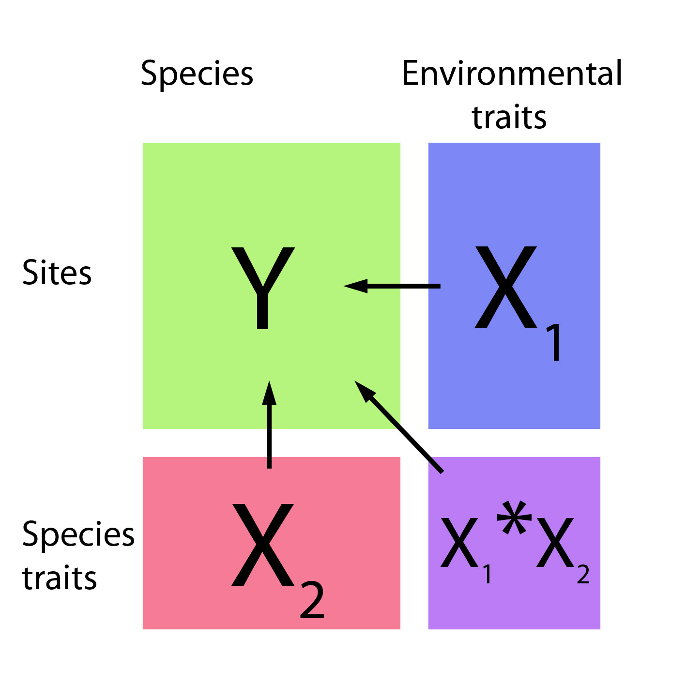

## today

+ dplyr and the "tidyverse"

--

+ the pipe operator

--

+ tidy data, pivoting data, joining tables

--

+ group and summarize

--

+ data visualization with ggplot2

---
class: middle, center, inverse
## manipulating and analyzing data with dplyr

```{r setup, include=FALSE}
options(htmltools.dir.version = FALSE)
library(knitr)
```

```{r xaringanthemer, include = FALSE}
library(xaringanthemer)
xaringanthemer::style_mono_accent(
  base_color = "#A70000",
  #  primary_color = "#A70000",
  #secondary_color = "#ff0000",
  white_color = "white",
  colors = c(
    red = "#A70000",
    purple = "#88398a",
    orange = "#ff8811",
    green = "#136f63",
    blue = "#4B4FFF",
    white = "#FFFFFF",
    black = "#181818"
  ),
  header_font_google = google_font("Roboto Condensed"),
  text_font_google   = google_font("Roboto Condensed", "300", "300i"),
  code_font_google   = google_font("Ubuntu Mono"),
  text_font_size = "24px",
  code_font_size = "24px",
  )
```


---
background-image: url("https://d33wubrfki0l68.cloudfront.net/621a9c8c5d7b47c4b6d72e8f01f28d14310e8370/193fc/css/images/hex/dplyr.png")
background-position: 98% 2%
background-size: 150px

## the tidyverse: an "umbrella" package

--

+ __ggplot2__: a "grammar of graphics" by Hadley Wickham. Divide the data and the <br> aesthetics. Create and modify the plots layer by layer

--

+ __dplyr__: a way to deal with data frames, sql external data bases, written in `C++`

--

+ __readr__: read data
--

+ __tidyr__: format data frames

--

+ __stringr__: deals with strings

--

+ __tibble__: a new data structure

--

+ other packages: __lubridate__ (dates), __forcats__ (factors), and many more

--

Most of R is still __base__-based and both philosophies communicate well with each other

---
## reading data with __readr__

```{r dplyr, message=FALSE}
library(dplyr)
library(readr)
```

--

```{r remedy001}
surveys <- readr::read_csv("data/raw/portal_data_joined.csv")
```

---
## the tibble

```{r remedy004, eval = FALSE}
surveys
vignette("tibble") #show what a vignette is
```

+ modified data frames
+ do not change input type (characters into factors)
+ do not change the name of the columns and allows for non-standard names, such as `1999` and `total count` (it will require back ticks)
+ no rownames
 <!-- + do not recycle vectors of length over 1 --> 
 <!-- + printing modified: ten rows, columns that fit, description of column type --> 
+ subsetting always returns a tibble

---

## some principal functions in __dplyr__

+ __select__ (columns)

--

+ __filter__ (rows)

--

+ __rename__ (columns)

--

+ __mutate__ (create new columns or modify existing columns)

--

+ __arrange__ to sort according to a column

--

+ __count__ cases of one or many columns

---
## select columns

```{r remedy005,results='hide'}

select(surveys, plot_id, species_id, weight)
```

--

1. there is no need to put quotes
2. there is no need to put variables between `c()`

--

#### base R still works in a tibble


```{r remedy006, results='hide'}
surveys[, c("plot_id", "species_id", "weight")]
```

---
## removing columns

```{r remedy007, results='hide'}
select(surveys, -record_id, -species_id)
```

---
## additional functions

```{r remedy008, results='hide'}
select(surveys, -ends_with("id"))
```

`starts_with`, `contains`, `all_of`, `last_col`

---
## filter rows

__logical clauses!__ 

```{r remedy010, results='hide'}
surv_1995 <- filter(surveys, year == 1995)
```

#### No need to use $ or brackets

```{r remedy009, results = "hide"}
surveys$year == 1995
surveys[surveys$year == 1995 , ]
```

---
## mutate creates or modifies columns

```{r remedy011, results = "hide"}
surveys <- mutate(surveys, weight_kg = weight / 1000)
```

```{r remedy012, eval = FALSE}

mutate(surveys,
       weight_kg = weight / 1000,
       weight_lb = weight_kg * 2.2)

```

---
## `group_by()` and `summarise()`

+ if you have a column factor (e.g. sex) and want to apply a function to the levels of this factor

```{r remedy013, message=F, warning=F}
surveys_g <-group_by(surveys, sex) #does nothing?
summary_sex <- summarize(surveys_g, 
                         mean_weight = mean(weight, na.rm = TRUE))
summary_sex
```

---
## another example: 

```{r remedy014, warning=F, message=F}
surveys_g2 <-group_by(surveys, sex, species_id)
mean_w <- summarize(surveys_g2, 
                    mean_weight = mean(weight, na.rm = TRUE))
```


---

```{r remedy015}
mean_w

```

---
## arrange sorts by a column

```{r arraange, eval = FALSE}
arrange(mean_w, mean_weight)


arrange(mean_w, desc(mean_weight))


```


---
background-image: url("https://external-content.duckduckgo.com/iu/?u=https%3A%2F%2Ftse1.mm.bing.net%2Fth%3Fid%3DOIP.kBwKFkkvi_Ye6osZkQrjnwAAAA%26pid%3DApi&f=1")
background-position: 98% 2%
background-size: 150px
## the pipe operator `%>%`

Classic syntax goes like this

```r
object1
object2 <- function1(object1)
object3 <- function2(object2)
```

--

...or you can nest functions and avoid create intermediary objects

```r
object3 <- function2(function1(object1))
```

--

The pipe operator allows to apply functions sequentially:

```r
object3 <- object1 %>% function1() %>% function2()
```

---
## select and filter

```{r remedy016, eval = FALSE}
surveys2 <- filter(surveys, weight < 5)
surveys_sml <- select(surveys2, species_id, sex, weight)

surveys %>%
  filter(weight < 5) %>%
  select(species_id, sex, weight)

```

+ you can append `head()` or `View()`

---
## `group_by()` and `summarize()`

```{r remedy017, warning=F, message=F, eval = FALSE}
surveys_g   <- group_by(surveys, sex) #does nothing?
summary_sex <- summarize(surveys_g, 
                         mean_weight = mean(weight, na.rm = TRUE))


summary_sex <- surveys %>%
  group_by(sex) %>% 
  summarize(mean_weight = mean(weight, na.rm = TRUE))
```

---
## count

```{r, eval = FALSE}
surveys %>%
    count(sex)

surveys %>%
  count(sex, species) 

surveys %>%
  count(sex, species) %>%
  arrange(species, desc(n))
```

---
## challenge


+ How many animals were caught in each `plot_type` surveyed?
+ Use `group_by()` and `summarize()` to find the mean, min, and max hindfoot length for each species (using `species_id`). Also add the number of observations (hint: see `?n`).

```{r, echo = F, eval=FALSE}
surveys %>%
  group_by(plot_type) %>% 
  summarise(n = n())
surveys %>%
  group_by(plot_type, species_id) %>% 
  summarise(n = n()) %>% 
  arrange(desc(n))
surveys %>%
  group_by(plot_type, species_id) 
```

--

```{r remedy018, echo = FALSE, eval = FALSE}
surveys %>%
    count(plot_type) 

surveys %>%
    filter(!is.na(hindfoot_length)) %>%
    group_by(species_id) %>%
    summarize(
        mean_hindfoot_length = mean(hindfoot_length),
        min_hindfoot_length = min(hindfoot_length),
        max_hindfoot_length = max(hindfoot_length),
        n = n()
    )
```

---
## save data!

```{r remedy019, eval = F, echo = TRUE}
surveys <- readr::read_csv("data/raw/portal_data_joined.csv")

surveys_complete <- surveys %>%
  filter(!is.na(weight),
         !is.na(hindfoot_length),
         !is.na(sex))

species_counts <- surveys_complete %>%
    count(species_id) %>% 
    filter(n >= 50)

surveys_complete <- surveys_complete %>%
  filter(species_id %in% species_counts$species_id)

write_csv(surveys_complete, path = "data/processed/surveys_mod_dplyr.csv")

```

 <!-- dim(surveys_complete) # 304463, 13 --> 

---
## tidy data as a philosohpy

+ datasets should be organized as __observations in rows__ and __variables in columns__ -> "tidy data"

```{r, echo = FALSE}
knitr::include_graphics("https://d33wubrfki0l68.cloudfront.net/6f1ddb544fc5c69a2478e444ab8112fb0eea23f8/91adc/images/tidy-1.png")
```

--

+ what is an observation? wht is the sampling unit?

--

+ do you have information in your column names? ex. if you have two columns: `1999` and `2000`, they should be inside a variable called __year__.


---
## some examples 

```{r, eval = FALSE, results="hide"}
library(tidyr)
table1
table2
table3
table4a #cases
table4b #population

```

---
## `pivot_longer()` and `pivot_wider()`

```{r, results = "hide"}
library(tidyr)
table4a
table4a %>% 
  pivot_longer(cols = c(`1999`, `2000`), names_to = "year", values_to = "cases")

table4b %>% 
  pivot_longer(c(`1999`, `2000`), names_to = "year", values_to = "population")

```

---
## `pivot_wider()`

```{r, results = "hide"}
table2 %>%
    pivot_wider(names_from = type, values_from = count)
```

---
## other options for tidying data

```{r, results="hide"}
table3
table3 %>% 
  separate(rate, into = c("cases", "population"))
table3 %>% 
  separate(rate, into = c("cases", "population"), convert = TRUE)

table5 %>% 
  unite(new, century, year)

```


---
## working with several tables: merges and joins

+ in real analysis settings you will have many tables that are related

--

+ relational datasets/databases

--

.pull-left[
  + in ecology for example:
    - sites x species
    - sites x environmental conditions
    - species x characteristics
    - individuals x individual measurement
]

.pull-right[
```{r, echo = F, out.width=300}

```
]

---
## working with several tables

+ keep the data as simple as possible, even if that means having different tables

--

+ for each data table have in mind the __sampling unit__. is it the species, is it the plot? is it the individual, the city? 

--

+ have a __unique identifier for each observation__ so you can merge the data

---
## working with several tables


```{r, echo = F}
knitr::include_graphics(
"https://raw.githubusercontent.com/gadenbuie/tidyexplain/master/images/full-join.gif")
knitr::include_graphics(
"https://raw.githubusercontent.com/gadenbuie/tidyexplain/master/images/left-join.gif")
```

.footnote[gadenbuie/tidyexplain]

---
## working with several tables

```{r, echo = F}
knitr::include_graphics(
"https://raw.githubusercontent.com/gadenbuie/tidyexplain/master/images/right-join.gif")
knitr::include_graphics(
"https://raw.githubusercontent.com/gadenbuie/tidyexplain/master/images/anti-join.gif")
```

.footnote[gadenbuie/tidyexplain]

---
## a short example

```{r}
tidy4a <- table4a %>% 
  pivot_longer(c(`1999`, `2000`), names_to = "year", values_to = "cases")
tidy4b <- table4b %>% 
  pivot_longer(c(`1999`, `2000`), names_to = "year", values_to = "population")

left_join(tidy4a, tidy4b)
```

---
## our survey data was created like that

```{r, eval = F}
download.file("https://ndownloader.figshare.com/files/3299483",
              "./data/raw/species.csv")
download.file("https://ndownloader.figshare.com/files/10717177",
              "./data/raw/surveys.csv")
download.file("https://ndownloader.figshare.com/files/3299474",
              "./data/raw/plots.csv")
```

---
## our survey data was created like that

```{r, eval = FALSE}
library(readr)
library(dplyr)
species <- read_csv("./data/raw/species.csv")
head(species)
surveys <- read_csv("./data/raw/surveys.csv")
head(surveys)
plots <- read_csv("./data/raw/plots.csv")
head(plots)
left_join(surveys, species) %>% left_join(plots) %>% dim()
```


---
class: middle, center
## data visualization with __ggplot2__


---
## __ggplot2__


+ __ggplot2__ separates the data from the aesthetics part and allows layers of information to be added sequentially with `+`

```r
ggplot(data = <data>,
       mapping = aes(<mappings>)) +
  geom_xxx()
```

+ __data__
+ __mappings__: the specific variables (x, y, z, group...)
+ __geom_xxx()__: functions for plotting options `geom_point()`, `geom_line()`

[cheat sheet link](https://rstudio.com/wp-content/uploads/2015/03/ggplot2-cheatsheet.pdf)

---
## ggplot2 plots are built sequentially in layers  


```{r ggplot, echo= TRUE, eval = TRUE, message=F, warning=F}
library(ggplot2)
library(readr)

surveys_complete <- read_csv("data/processed/surveys_mod_dplyr.csv")

```


---
## ggplot2 plots are built sequentially in layers  

<small>
```{r, out.width=350}
ggplot(data = surveys_complete,                          # data
       mapping = aes(x = weight, y = hindfoot_length)) + # aesthetics
  geom_point()                                        # plot function
```


---
## you can assign a plot to an object and build on it

<small>
```{r, out.width=350}
weight_hind <- ggplot(data = surveys_complete, 
                       mapping = aes(x = weight,
                                     y = hindfoot_length))
weight_hind + 
    geom_point()
```

---
## ggplot2 plots are built sequentially in layers  

<small>
```{r, out.width=350}
weight_hind + 
    geom_point(alpha = 0.1) #transparency
```


---
## ggplot2 plots are built sequentially in layers  

<small>
```{r, out.width=350}
weight_hind + 
    geom_point(alpha = 0.1, color = "blue") #color
```


---
## ggplot2 plots are built sequentially in layers  

<small>
```{r, out.width=350}
weight_hind + 
    geom_point(alpha = 0.1, aes(color = "blue")) #this is a mistake!
#blue is not a variable so it should not go inside aes()
```


---
## ggplot2 plots are built sequentially in layers  

<small>
```{r, out.width=350}
weight_hind + 
    geom_point(alpha = 0.1, aes(color = species_id))
# but variables do go inside aes()
```

---
## challenge: change x to categorial variable

<small>
```{r, out.width=350}
ggplot(data = surveys_complete, 
       mapping = aes(x = species_id, y = weight)) +
   geom_point(aes(color = plot_type))
```


---
## boxplots!

<small>
```{r, out.width=350}
# boxplots
ggplot(data = surveys_complete, 
       mapping = aes(x = species_id, y = weight)) +
   geom_boxplot()
```


---
## theme options `theme_`

<small>
```{r, out.width=350}
ggplot(data = surveys_complete, 
       mapping = aes(x = species_id, y = weight)) +
   geom_boxplot() +
  theme_classic()
```


---
## add jitter layer 

<small>
```{r, out.width=350}
ggplot(data = surveys_complete, 
       mapping = aes(x = species_id, y = weight)) +
   geom_boxplot() +
  geom_jitter(alpha = 0.3, color = "dodgerblue", width = 0.2) +
  theme_classic()
```

---
## change plot order

<small>
```{r, out.width=350}
ggplot(data = surveys_complete, 
       mapping = aes(x = species_id, y = weight)) +
  geom_jitter(alpha = 0.3, color = "dodgerblue", width = 0.2) +
  geom_boxplot() +
  theme_classic()
```


---
## violin plots

<small>
```{r, out.width=350}
ggplot(data = surveys_complete, 
       mapping = aes(x = species_id, y = weight)) +
   geom_violin() + theme_classic()
```


---
## change scale (`scale_xx` options)

<small>
```{r, out.width=350}
p <- ggplot(data = surveys_complete, 
       mapping = aes(x = species_id, y = weight)) +
   geom_violin() + scale_y_log10() + theme_classic() #nice!
p
```

---
## add title `ggtitle()`

```{r, out.width=350}
p +  #remember the plot can be an object
  ggtitle("Nice violin plot")
```


---
## ggplot2 plots are built sequentially in layers  

<small>
```{r, out.width=350}  
ggplot(data = surveys_complete, 
       mapping = aes(x = species_id, y = hindfoot_length)) +
   geom_jitter(size = 0.5, alpha = 0.1, width = 0.2, aes(col = plot_id)) +
   geom_boxplot() + scale_y_log10() + theme_classic() + ggtitle("Nice violin plot")
```


---
## what would be next?

- learn to write __functions__ for your own workflow and other programming tools to __iterate__ these functions accross many inputs (loops and the __purrr__ package)

- study R-specific literature such as R4DS and Advanced R

- study specific packages in your area, read their vignettes and documentation, get acquainted with the workflows

- learn tools for __communicating__ your results (text, presentations, dashboards): markdown & R markdown, __xaringan__ (presentations)

- learn about version control (__git__) to backup and control changes for your projects


---
# references

+ R for data science
+ Reproducible workflows
+ [https://github.com/gadenbuie/tidyexplain](https://github.com/gadenbuie/tidyexplain)
