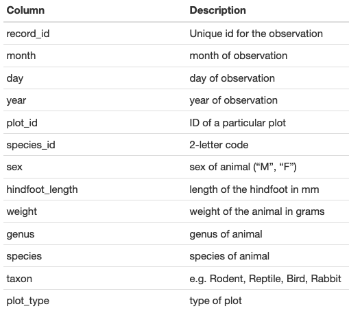

## last time

```{r setup, include=FALSE}
options(htmltools.dir.version = FALSE)
library(knitr)
```

```{r xaringanthemer, include = FALSE}
xaringanExtra::use_share_again()
```

+ we setup a project and its file structure

+ we started using R inside RStudio

+ we created numerical, character and logical vectors with `c()` 

+ we learned to subset vectors with brackets `[]` and other functions: `length()`, `:`, `seq(from, to, interval)`

+ vector subset can be done via numeric or logical indexes

---
## data structures in R

+ __vector__: lineal arrays (one dimension: only length)
--

+ __matrices__: arrays of vectors of the same type (all numeric or all character, for instance) (two dimensions: width and length)
--

+ __data frames__: two-dimensional structures ("rectangular") but might be of combined types (i.e., column 1 with names, column 2 with numbers)
--

+ __factors__: vectors (one-dimensional) representing __categorical variables__ and thus having __levels__
--

+ __lists__: literally lists, of objects that can be of any type (a list of data frames, or different objects)
--

+ __arrays__ are similar to matrices and dataframes but may be three-dimensional ("layered" data frames)


---
## matrices

+ data have to be of the same type

```{r}
?matrix
matrix(nrow = 4, ncol = 3)
```

---
## matrices

+ you can also fit vectors with the correct dimensions 

```{r, eval = TRUE, results='hide'}
nums <- 1:12
matrix(data = nums, nrow = 3)
matrix(data = nums, nrow = 3, byrow = TRUE)
```

---
## matrices

+ naming a matrix: `NULL or a list of length 2 giving the row and column names respectively.`  (?) look at the examples!

---
## matrices 

```{r, results="hide"}
dim1_names <- c("row1", "row2", "row3")
dim2_names <- c("col1", "col2", "col3", "col4")
names_matrix <- list(dim_1 = dim1_names, dim_2 = dim2_names)
str(names_matrix)
m <- matrix(data = nums, nrow = 3,
       dimnames = names_matrix)
dim(m)
dimnames(m)
```
--

+ you can convert easily between data types `data.frame("m")`, `as.data.frame("m")`, `as.vector(m)`.
(the same goes for changes between "numeric", "logical")


---
class: inverse, middle, center
## starting with data frames

---
## the survey dataset

+ Data frames: one row per sampling unit (individual), one column per variable

```{r columns, eval = T, echo = F, fig.align="center", out.width=400}

```


---
## downloading the dataset

We are going to download the file to our `./data/raw` sub folder:

```{r, echo = FALSE, eval = TRUE}
if (!file.exists("./data/raw")) dir.create("./data/raw", recursive = TRUE)
if (!file.exists("./data/raw/portal_data_joined.csv")) {
download.file(url = "https://ndownloader.figshare.com/files/2292169",
              destfile = "./data/raw/portal_data_joined.csv")
}
```

```{r, eval = FALSE}
download.file(url = "https://ndownloader.figshare.com/files/2292169",
              destfile = "./data/raw/portal_data_joined.csv")
```

---
## reading files into R

Functions to read data are key to any project.
for data frames: `read.csv()`, `read.delim()`


```{r}
surveys <- read.csv("./data/raw/portal_data_joined.csv")
surveys_check <- read.table(file = "./data/raw/portal_data_joined.csv",
                            sep = ",",
                            header = TRUE)
identical(surveys, surveys_check)
```

---
## reading files into R

+ Package __readr__ 
+ Package __data.table__ (`data.table::fread()`) when you need to open a large file
+ Excel spreadsheets: `readxl::read_excel()`
+ __Graphic interface__

There are __many other ways__ to read data into R, some are specific for the type of data (GIS shapefiles or raster, and specific packages may come with their own reader functions)

---
## inspecting `data.frame` objects

```{r try, echo = TRUE, eval = FALSE}
str(surveys)
dim(surveys)
nrow(surveys)
ncol(surveys)
head(surveys) # 6 rows by default
tail(surveys)
names(surveys)
rownames(surveys)
length(surveys) # number of columns
summary(surveys)
```

---
## inspecting `data.frame` objects

Based on the output of `str(surveys)`, can you answer the following questions?

+ What is the class of the object surveys?

+ How many rows and how many columns are in this object?

+ What is the type of data of the columns?


---
## indexing and subsetting data frames

+ a vector has only one dimension, so:

  + `length()` refers to number of __elements__
  + `dim()`
  + selection between brackets `[]`

--

+ a data.frame has __two__ dimensions: `dim()`, `ncol()`, `nrow()` selection between brackets `[]` __BUT with the two dimensions separated by a comma__: `[rows, columns]`

--

+ we'll try to refer to these operations as __selecting columns__ and __filtering rows__

---
## selecting columns

+ with numeric indexes and vectors 

```{r, eval = FALSE}
surveys[, 6]
surveys[1, ]
surveys[ , 13]
surveys[4, 13]
surveys[1:4, 1:3]

```

---
## indexing and subsetting data frames

+ minus sign to __remove__ the indexed column or row

```{r, eval = FALSE}
# The whole data frame, except the first column
surveys[, -1]
nrow(surveys)
surveys[-(7:34786), ] # Equivalent to head(surveys)
```

---
## selecting columns by name

```{r subset, eval = FALSE}
names(surveys)

  surveys["species_id"]       # Result is a data.frame
  surveys[["species_id"]]     # Result is a vector
* surveys[, "species_id"]     # Result is a vector
* surveys$species_id          # Result is a vector
```

+ R has several ways to do some things

---
## indexing and subsetting data frames

<small>
```{r, eval = FALSE, echo = TRUE}
sub <- surveys[1:10,]
# first element in the first column of the data frame

# first element in the 6th column

# first column of the data frame (as a vector)

# first column of the data frame (as a dataframe)

# first three elements in the 7th column (as a vector)

# the 3rd row of the data frame

# equivalent to head_surveys <- head(surveys)


```


---
## indexing and subsetting data frames

<small>
```{r, eval = FALSE, echo = TRUE}
sub <- surveys[1:10,]
# first element in the first column of the data frame
sub[1, 1]
# first element in the 6th column
sub[1, 6]
# first column of the data frame (as a vector)
sub[, 1]
# first column of the data frame (as a dataframe)
sub[1]
# first three elements in the 7th column (as a vector)
sub[1:3, 7]
# the 3rd row of the data frame
sub[3, ]
# equivalent to head_surveys <- head(surveys)
head_surveys <- surveys[1:6, ]

```


---
## challenge

<small>

+ Create a data.frame (`surveys_200`) containing only the data in row 200 of the `surveys` dataset

--

+ Notice how `nrow()` gave you the number of rows in a data.frame? Use that number to pull out just that last row in the data frame

--

+ Compare that with what you see as the last row using `tail()` to make sure it’s meeting expectations

--

+ Pull out that last row using `nrow()` instead of the row number.

--

+ Create a new data frame (`surveys_last`) from that last row.

--

+ Use `nrow()` to extract the row that is in the middle of the data frame. Store the content of this row in an object named `surveys_middle`.

--

+ Combine `nrow()` with the - notation above to reproduce the behavior of `head(surveys)`, keeping just the first through 6th rows of the surveys dataset.

</small>

```{r challenge2, eval = FALSE, echo = FALSE}
# Create a data.frame (`surveys_200`) containing only the data in row 200 of the `surveys` dataset

# Notice how `nrow()` gave you the number of rows in a data.frame? Use that number to pull out just that last row in the data frame

# Compare that with what you see as the last row using `tail()` to make sure it’s meeting expectations

# Pull out that last row using `nrow()` instead of the row number.

# Create a new data frame (`surveys_last`) from that last row.

# Use `nrow()` to extract the row that is in the middle of the data frame. Store the content of this row in an object named `surveys_middle`.

# Combine `nrow()` with the - notation above to reproduce the behavior of `head(surveys)`, keeping just the first through 6th rows of the surveys dataset.

```

---
## dealing with missing data

```{r, results = "hide"}
sub <- surveys[1:10,]
#str(sub)
sub$hindfoot_length 
sub$hindfoot_length == NA #it cannot compare! because it's NA 
#we use is.na: 
#is.na(sub$hindfoot_length) # yes! returns a logical vector 
sub$hindfoot[!is.na(sub$hindfoot_length)]
```

---
## dealing with missing data

+ in some functions: `na.rm`

```{r}
mean(sub$hindfoot_length)
mean(sub$hindfoot_length, na.rm = T)
```


---
## dealing with missing data

+ Dealing with missing data in dataframes: __filtering rows that have NAs__

```{r}
non_NA_w <- surveys[!is.na(surveys$weight),]
dim(non_NA_w)
non_NA <- surveys[!is.na(surveys$weight) &
                    !is.na(surveys$hindfoot_length),]
dim(non_NA)

```

---
## dealing with NAs

```{r}
#complete.cases(surveys)
surveys1 <- surveys[complete.cases(surveys) , ]
surveys2 <- na.omit(surveys)
dim(surveys1)
dim(surveys2)
```

---
## write csv objects to disk

```{r}
if (!dir.exists("data/processed")) dir.create("data/processed", recursive = T)
write.csv(surveys1, "data/processed/surveys_mod.csv")
```

#### remember you never overwrite your original, raw data!

---
## read the modified csv  

```{r,results= "hide"}
surveys <- read.csv("data/processed/surveys_mod.csv")
str(surveys)

```


---
## factors

+ __factors__: vectors (one-dimensional) representing __categorical variables__ and thus having __levels__. ordered (`c(“low”, “medium”, “high”)` or unordered (`c("green", "blue", "red")`)

+ R < 4.0 had a default behavior `stringsAsFactors = TRUE` so any character column was transformed into a factor

```r
`?read.csv()`
?default.stringsAsFactors
```

#### today if we want factors we have to transform the vectors

---
## factors

<small>
```{r eval = FALSE, echo= TRUE}
## Compare the difference between our data read as
#`factor` vs `character`.
surveys <- read.csv("data/raw/portal_data_joined.csv",
                    stringsAsFactors = FALSE)
str(surveys)

surveys <- read.csv("data/raw/portal_data_joined.csv",
                    stringsAsFactors = TRUE)
str(surveys)
```

---
## factors

Convert the column "plot_type" and "sex" into a factor:

```{r}
surveys$plot_type <- factor(surveys$plot_type)
surveys$sex <- factor(surveys$sex)

```

(actually this is a way to create new columns)

---
## working with factors

<small>
```{r remedy001, echo = TRUE, eval = FALSE}
sex <- factor(c("male", "female", "female", "male"))
levels(sex) # in alphabetical order!
nlevels(sex)
sex
sex <- factor(sex, levels = c("male", "female"))
sex # after re-ordering
as.character(sex)

```

---
## let's make a plot of a factor variable

`plot(as.factor(surveys$sex))`

.pull-right[let's rename this label]

```{r plot, eval = TRUE, echo = FALSE}
plot(as.factor(surveys$sex))
#take the variable out
sex <- factor(surveys$sex)
#head(sex, n = 6)
#levels(sex)
levels(sex)[1] <- "undetermined"
#levels(sex)
#head(sex) # hasta aquí con ellos
```

---
## let's make a plot of a factor variable

`plot(sex)`

.pull-right[let's rename this label]

```{r plot2, eval = TRUE, echo = FALSE}
plot(sex, xlab = "Sex", ylab = "Count")
```


---
## challenge

<small>

.pull-left[
```{r remedy003, echo = FALSE, eval = TRUE}
levels(sex)[2] <- "female"
levels(sex)[3] <- "male"
sex <- factor(sex, levels = c("female", "male", "undetermined"))
plot(as.factor(sex), xlab = "Sex")
```
]

.pull-right[

+ Rename “F” and “M” to “female” and “male” respectively.

+ Now that we have renamed the factor level to “undetermined”, can you recreate the barplot such that “undetermined” is last (after “male”)?
]


---
## some basic plotting 

```{r, eval = F}
plot(surveys$hindfoot_length)
plot(surveys$weight)
plot(sort(surveys$hindfoot_length))
plot(sort(surveys$weight))

```

---
## scatterplots

+ two continuous variables

```{r, eval =F}
x <- surveys$weight
y <- surveys$hindfoot_length
plot(x, y) 
#but you can also avoid creating the vectors
plot(surveys$weight, surveys$hindfoot_length) #check the help for parameter order, x, y axis.
```

---
## boxplots

```{r, eval=FALSE}
head(surveys$plot_type)
levels(surveys$plot_type)
```

# boxplots

```{r, eval = F}
plot(surveys$weight ~ surveys$plot_type)
```

+ check the __tilde__ `~` notation, formula:
"as a function of"

`plot(a ~ b)`
`plot(b, a)`

---
## plotting basics

all parameters for plotting are in function `par()`

```{r, eval = FALSE}
plot(x, y)
plot(x, y, xlab = "Hindfoot length", ylab = "Weight", cex = 0.9, pch = 19)
plot(x, y, xlab = "Hindfoot length", ylab = "Weight", cex = 0.9, pch = 19, col = "red")
plot(x, y, xlab = "Hindfoot length", ylab = "Weight", cex = 0.9, pch = 19, col = surveys$sex)
```

+ pch, cex, xlab, ylab, 

+ __saving a plot!__


